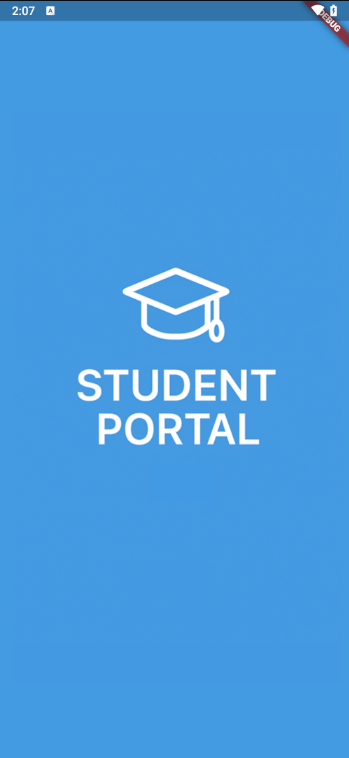
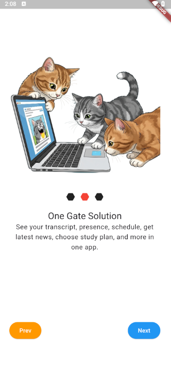
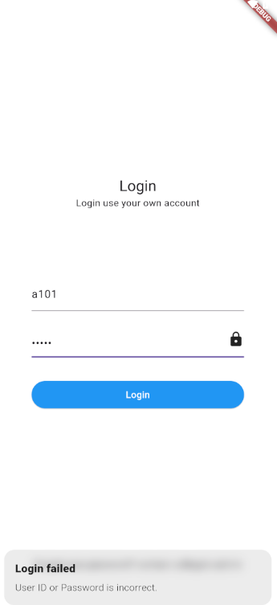
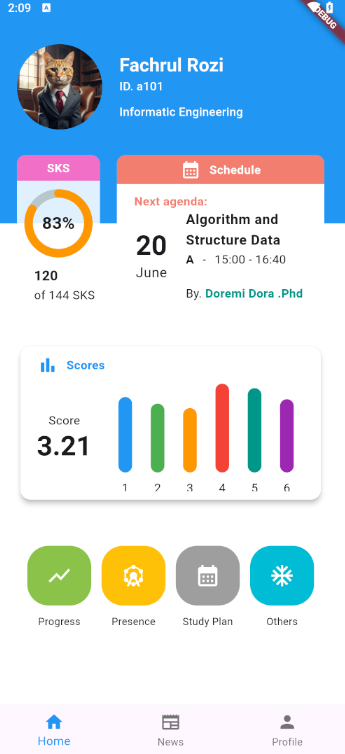
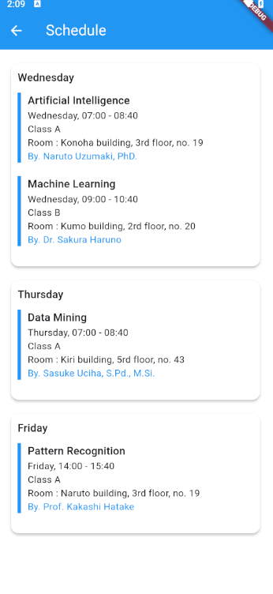
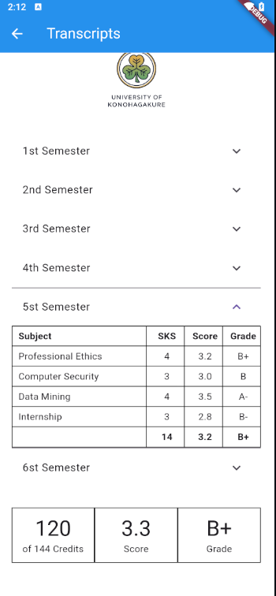
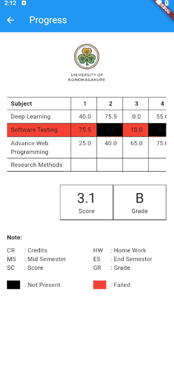
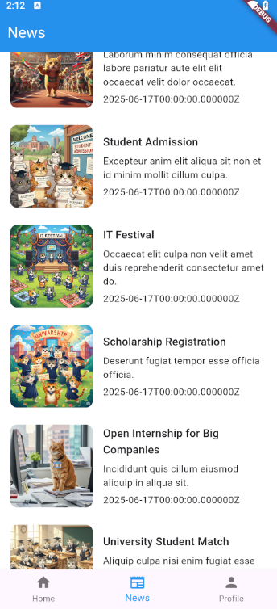
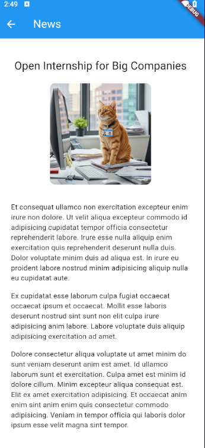
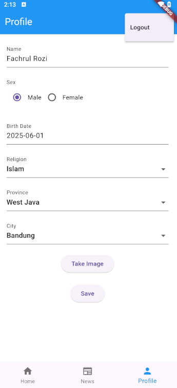

# Student Portal

An "One Gate App" for College's student, contains several features, like get reports, transcripts, latest news, update profile, and more.

There are several libraries used in this app, like: 

<table>
  <thead>
    <tr>
      <th>Library</th>
      <th>Description</th>
    </tr>
    <tr>
      <td>get</td>
      <td>State management</td>
    </tr>
    <tr>
      <td>dio</td>
      <td>Integrate with API</td>
    </tr>
    <tr>
      <td>flutter_secure_storage</td>
      <td>Save user token for api's authentication</td>
    </tr>
    <tr>
      <td>infinite_scroll_pagination</td>
      <td>Show next page content only scroll down it screen.</td>
    </tr>
    <tr>
      <td>flutter_html</td>
      <td>Read HTML in page</td>
    </tr>
    <tr>
      <td colspan="2">and more (see pubspec.yaml)</td>
    </tr>
  </thead>
</table>

Note: unfortunatelly, it's API is still in local, not deployed in cloud. Contact me if you want me send you it's API (API built using laravel)

These are several screens and it explanation:

<ul>
  <li>
    <b>Splash</b>
    
Show splash screen for 2 seconds, then go to onboarding page.

    
  </li>
  <li>
    <b>Onboarding</b>
    
There are 3 onboarding pages here, these app used for introduce app at glance for user. After these pages, app will redirect to login page.

    
  </li>
  <li>
    <b>Login</b>
    
Check first if user token exist then auto redirect to dashboard page. If not yet, show login page and integrate to API to check is username/password valid or not.

    
  </li>
  <li>
    <b>Dashboard</b>
    
There are 3 main features here: home, news, and profile. User can go to each page using bottom navigation.

    
  </li>
  <li>
    <b>Schedule</b>
    
Show schedules of each days and their details.

    
  </li>
  <li>
    <b>Transcript</b>
    
Show transcript report of previous semester.

    
  </li>
  <li>
    <b>Progress</b>
    
Show progress report of this semester. See attendance, scores (home work, mid/end test, etc), up to estimating final score.

    
  </li>
  <li>
    <b>News</b>
    
Show latest news. This feature use infinite-scroll-pagination, so user can go to next page just scroll down it.

    
  </li>
  <li>
    <b>News Detail</b>
    
Read news detail.

    
  </li>
  <li>
    <b>Profile</b>
    
Show profile and update it if user want. There are several inputs like text input, dropdown, up to image picker.

    
  </li>
</ul>